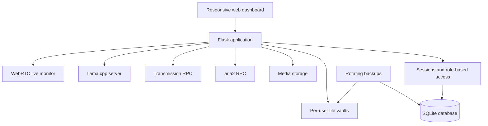

# CloudInBuzunar

A self-hosted personal cloud platform running on Android through Termux.
It combines secure file storage, media management, background downloads,
local AI and administrative tools in one responsive web dashboard.

> Personal engineering project built to explore Linux administration,
> backend development, authentication, storage, networking and local AI
> on resource-constrained hardware.

## Highlights

- Runs on an Android phone as a small home server
- Multi-user authentication with administrator and user roles
- Isolated file vault for every user
- Full administrative management of all user vaults
- Personal media library with resumable large-file uploads
- HTTP, HTTPS, magnet and `.torrent` download management
- Private local AI using `llama.cpp` and Qwen2.5 models
- Persistent, per-user AI conversation history
- Opt-in camera and microphone streaming through WebRTC
- Automatic rotating backups
- Administrator-only system status dashboard
- Responsive interface built without a frontend framework

## Features

### Authentication and access control

- SQLite user database
- Password hashing with Werkzeug
- Session-based authentication
- Administrator and regular-user roles
- User activation and deactivation
- Password and role management commands
- Login throttling and login-attempt auditing
- Generic authentication errors to avoid exposing account information

### Per-user File Vault

- Separate storage directory for every user
- Nested folders and breadcrumb navigation
- Upload, download, rename and delete operations
- Recursive folder deletion with confirmation
- Safe path resolution to prevent directory traversal
- Administrator access to manage every user vault

### Media Library

- Personal media storage for every user
- Image, audio and video categorization
- Resumable chunked uploads for large files
- Upload continuation after interrupted connections
- Administrative management of all media libraries
- Media data excluded from automatic backups to avoid duplication of
  very large files

### Download Manager

Two local download engines are integrated:

- `aria2` for HTTP, HTTPS and magnet downloads
- Transmission for BitTorrent and private-tracker compatibility

Available operations include:

- Add links, magnets and `.torrent` files
- Choose the owner and destination
- Monitor progress and transfer speed
- Pause and resume downloads
- Remove download jobs
- Keep completed torrents available for seeding

### Local AI

- Runs entirely on the device through `llama.cpp`
- Qwen2.5 1.5B rapid mode
- Qwen2.5 3B quality mode
- Runtime model switching from the dashboard
- Persistent SQLite conversation history
- Separate conversation history for every user
- No external AI API required
- Models and conversations remain on the local server

### Backup and recovery

- Manual or scheduled local backups
- Configurable backup retention
- SQLite database, configuration and user vaults included
- Large media storage excluded by design
- Runtime data is stored outside the Git repository

### Live monitor

- Direct WebRTC video and audio between the phone and an administrator
- Native Android companion app in `android-monitor/`
- Foreground service remains armed when the screen is off
- Camera and microphone stay off until an administrator starts capture
- An administrator can start and stop capture from the PC dashboard
- Pairing uses a single-use code instead of storing an administrator password
- Device tokens are encrypted with Android Keystore
- Arming requires a local button press and Android permissions
- Persistent Android notification shows the armed/live state
- Administrators can stop the source remotely
- Rolling audio or 480p video recordings with 24/48-hour retention
- Local speech-activity markers link directly to likely conversation moments
- Signaling data is kept locally in SQLite
- No external streaming service or cloud relay is required on the LAN

The browser source remains available as a foreground-only fallback. Android
does not allow a camera/microphone foreground service to be cold-started from
the background, so the companion app must be opened and armed again after a
phone restart or Force stop.

## Architecture



## Technology stack

- Python
- Flask
- Gunicorn
- SQLite
- Vanilla JavaScript
- HTML and CSS
- aria2 JSON-RPC
- Transmission RPC
- llama.cpp
- Qwen2.5 GGUF models
- Android and Termux
- Git

## Project structure

```text
app/
├── main.py             Main Flask application and File Vault API
├── database.py         SQLite schema and data-access functions
├── manage_users.py     User administration CLI
├── backup.py           Rotating backup utility
├── media.py            Media library backend
├── downloads.py        aria2 and Transmission integration
├── ai.py               Local AI API and conversation history
├── ai_runtime.py       AI model process manager
├── monitor.py          Local WebRTC signaling API
├── system_status.py    Read-only service health checks
├── static/             JavaScript and CSS
└── templates/          HTML templates
```

The native companion lives separately:

```text
android-monitor/
└── app/                 Android camera/microphone foreground service
```

### Build the Android companion

The GitHub Actions workflow **Build Android monitor APK** builds a debug APK
whenever `android-monitor/` changes. The newest development build is published
as a rolling GitHub Release and can be downloaded without signing in:

[Download CloudInBuzunar Monitor for Android](https://github.com/clementinny/cloud-in-buzunar/releases/download/android-monitor-latest/cloud-in-buzunar-monitor.apk)

After installation:

1. Open `/monitor` on the PC while logged in as administrator.
2. Generate a pairing code.
3. Open the Android app and enter the code.
4. Grant camera, microphone and notification permissions, then tap **Arm**.
5. The phone screen may now be turned off; start and stop capture from the PC.

## Quick start

The core application requires Python and SQLite. The target environment is
Termux/Linux.

```bash
git clone <repository-url>
cd cloud-in-buzunar

python -m venv .venv
source .venv/bin/activate

pip install -r requirements.txt

python -c \
'from app.database import initialize_database; initialize_database()'

python -m app.manage_users --help
```

Create the first user by following the `manage_users create` help, then start
the web application:

```bash
gunicorn \
  --bind 0.0.0.0:8080 \
  app.main:app
```

Open the server from another device on the same trusted network:

```text
http://PHONE_IP_ADDRESS:8080
```

## Optional local services

The following integrations are optional and run only on localhost:

| Service | Default address | Purpose |
|---|---|---|
| aria2 RPC | `127.0.0.1:6800` | HTTP, HTTPS and magnet downloads |
| Transmission RPC | `127.0.0.1:9091` | BitTorrent downloads and seeding |
| llama.cpp server | `127.0.0.1:8081` | Local Qwen inference |

Model files, RPC secrets, databases, uploaded files and logs are intentionally
not included in the repository.

Speech-activity markers use local FFmpeg audio analysis. On Termux, enable
them with `pkg install ffmpeg`; recordings still work when FFmpeg is absent.

## Runtime data

Private runtime data is stored separately:

```text
~/cloud-in-buzunar-data/
```

This includes:

- SQLite database
- Flask secret key
- RPC credentials
- Uploaded files
- Media files
- Downloads
- AI models
- Logs
- Backups

## Security notes

- Passwords are stored as hashes, not plaintext
- Application and RPC secrets are stored outside the repository
- User files are isolated by account
- Administrative endpoints require the administrator role
- File paths are validated before filesystem operations
- The application is intended for a trusted private network

Before exposing the service to the public internet, HTTPS, a properly
configured reverse proxy and additional security review are required.

## Roadmap

- Unified service-status dashboard
- HTTPS and reverse-proxy support
- Expiring public file-sharing links
- Automated tests and continuous integration
- Improved installation and recovery tooling

## Development status

This project is under active development and is currently used as a personal
homelab and learning platform.
