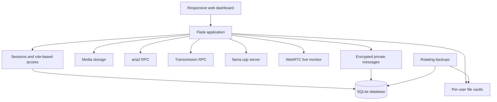

# CloudInBuzunar

[](https://github.com/clementinny/cloud-in-buzunar/actions/workflows/tests.yml)

A self-hosted personal cloud platform running on Android through Termux.
It combines secure file storage, encrypted private messaging, media
management, background downloads, local AI and administrative tools in one
responsive web dashboard.

> Personal engineering project built to explore Linux administration,
> backend development, authentication, storage, networking and local AI
> on resource-constrained hardware.

## Highlights

- Runs on an Android phone as a small home server
- Multi-user authentication with administrator and user roles
- Isolated file vault for every user
- Expiring public file links with optional download limits
- Full administrative management of all user vaults
- Personal media library with resumable large-file uploads
- HTTP, HTTPS, magnet and `.torrent` download management
- Private local AI using `llama.cpp` and Qwen2.5 models
- Persistent, per-user AI conversation history
- Encrypted private messaging between active users
- Opt-in camera and microphone streaming through WebRTC
- Automatic rotating backups
- Administrator-only system status dashboard
- Live CPU, RAM, storage, network, GPU and process monitor
- Optional root-aware CPU/GPU view with Android-wide process usage
- Thermal guardian with automatic heavy-service suspension and recovery
- Seven-day CPU, GPU and temperature history
- Root-aware battery health and supported charge-limit controls
- Safe dashboard controls for AI, aria2 and Transmission
- Termux:Boot autostart, watchdog and daily backup supervision
- Caddy HTTPS reverse proxy for LAN, VPN or a public domain
- Portable, checksum-verified migration archives for another phone
- Automated Python, JavaScript and shell checks on every GitHub change
- Responsive interface built without a frontend framework

## Features

### Authentication and access control

- SQLite user database
- Password hashing with Werkzeug
- Session-based authentication
- Administrator and regular-user roles
- User activation and deactivation
- Public account requests with administrator approval or rejection
- Password and role management commands
- Login throttling and login-attempt auditing
- Generic authentication errors to avoid exposing account information

### Per-user File Vault

- Separate storage directory for every user
- Nested folders and breadcrumb navigation
- Upload, download, rename and delete operations
- Recursive folder deletion with confirmation
- Safe path resolution to prevent directory traversal
- Administrator access to manage every user vault
- Temporary links that can expire, be download-limited and revoked

Public share tokens are generated from 256 bits of randomness and only their
SHA-256 hashes are stored in SQLite. Share them only through HTTPS or an
already trusted private VPN; anyone who has an active link can download its
file until the link expires, reaches its limit or is revoked.

### Private messaging

- Direct conversations between active server accounts
- Message history and unread counters stored in SQLite
- Automatic updates without reloading the page
- Authenticated encryption at rest using a private server key
- Message text is rendered safely as text, never as HTML

The server decrypts messages for authenticated participants, so this protects
the SQLite contents at rest but is not end-to-end encryption. The encryption
key is stored outside Git and included in local backup archives so restored
messages remain readable. Backups must therefore be protected like the live
server data.

### Media Library

- Personal media storage for every user
- Image, audio and video categorization
- Resumable chunked uploads for large files
- Upload continuation after interrupted connections
- Administrative management of all media libraries
- Media data excluded from automatic backups to avoid duplication of
  very large files

### Download Manager

Two local download engines are integrated:

- `aria2` for HTTP, HTTPS and magnet downloads
- Transmission for BitTorrent and private-tracker compatibility

Available operations include:

- Add links, magnets and `.torrent` files
- Choose the owner and destination
- Monitor progress and transfer speed
- Pause and resume downloads
- Start or stop seeding separately for every completed torrent
- Stop Transmission completely without the watchdog restarting it
- Remove download jobs
- Keep completed torrents available for seeding

### Local AI

- Runs entirely on the device through `llama.cpp`
- Qwen2.5 1.5B rapid mode
- Qwen2.5 3B quality mode
- Runtime model switching from the dashboard
- Persistent SQLite conversation history
- Separate conversation history for every user
- No external AI API required
- Models and conversations remain on the local server

### Backup and recovery

- Manual or scheduled local backups
- Configurable backup retention
- SQLite database, user vaults and message-encryption key included
- Administrator-only backup list in the system-status dashboard
- SHA-256, archive-path and SQLite integrity checks before restoration
- Automatic safety backup before current data is replaced
- Rollback to the previous state if restoration fails
- Exact backup-name confirmation before a dashboard restoration
- Controlled Gunicorn reload after a successful dashboard restoration
- Large media storage excluded by design
- Runtime data is stored outside the Git repository

Backups can also be inspected and restored from Termux:

```bash
python -m app.backup list
python -m app.backup verify BACKUP_NAME.tar.gz
python -m app.backup restore BACKUP_NAME.tar.gz
```

The restore command asks for an exact confirmation and creates a new safety
backup first. The `--yes` option is intended only for an already controlled,
non-interactive recovery procedure.

### Live monitor

- Direct WebRTC video and audio between the phone and an administrator
- Native Android companion app in `android-monitor/`
- Foreground service remains armed when the screen is off
- Camera and microphone stay off until an administrator starts capture
- An administrator can start and stop capture from the PC dashboard
- Pairing uses a single-use code instead of storing an administrator password
- Device tokens are encrypted with Android Keystore
- Arming requires a local button press and Android permissions
- Persistent Android notification shows the armed/live state
- Administrators can stop the source remotely
- Rolling audio or 480p video recordings with 24/48-hour retention
- Local speech-activity markers link directly to likely conversation moments
- Signaling data is kept locally in SQLite
- No external streaming service or cloud relay is required on the LAN

The browser source remains available as a foreground-only fallback. Android
does not allow a camera/microphone foreground service to be cold-started from
the background, so the companion app must be opened and armed again after a
phone restart or Force stop.

## Architecture



## Technology stack

- Python
- Flask
- Gunicorn
- SQLite
- Vanilla JavaScript
- HTML and CSS
- aria2 JSON-RPC
- Transmission RPC
- llama.cpp
- Qwen2.5 GGUF models
- Android and Termux
- Git

## Project structure

```text
app/
├── main.py             Main Flask application and File Vault API
├── database.py         SQLite schema and data-access functions
├── manage_users.py     User administration CLI
├── backup.py           Rotating backup utility
├── backup_admin.py     Administrator backup and restore API
├── media.py            Media library backend
├── downloads.py        aria2 and Transmission integration
├── ai.py               Local AI API and conversation history
├── ai_runtime.py       AI model process manager
├── messaging.py        Private user messaging API
├── message_crypto.py   Message encryption and key management
├── monitor.py          Local WebRTC signaling API
├── system_status.py    Read-only service health checks
├── resource_monitor.py CPU, memory, network and process metrics
├── static/             JavaScript and CSS
└── templates/          HTML templates
scripts/
├── cloud-services.sh              Service manager and watchdog
├── install-termux-autostart.sh    Termux:Boot installer
├── install-cloud-in-buzunar.sh    Complete Termux installer
├── cloud-migrate.py               Portable export, verify and import
├── configure-https.sh             Safe Caddy configuration generator
└── cloud-https.sh                 HTTPS proxy process manager
```

The native companion lives separately:

```text
android-monitor/
└── app/                 Android camera/microphone foreground service
```

### Build the Android companion

The GitHub Actions workflow **Build Android monitor APK** builds a debug APK
whenever `android-monitor/` changes. The newest development build is published
as a rolling GitHub Release and can be downloaded without signing in:

[Download CloudInBuzunar Monitor for Android](https://github.com/clementinny/cloud-in-buzunar/releases/download/android-monitor-latest/cloud-in-buzunar-monitor.apk)

After installation:

1. Open `/monitor` on the PC while logged in as administrator.
2. Generate a pairing code.
3. Open the Android app and enter the code.
4. Grant camera, microphone and notification permissions, then tap **Arm**.
5. The phone screen may now be turned off; start and stop capture from the PC.

## Quick start

The core application requires Python and SQLite. The target environment is
Termux/Linux.

For a new Android/Termux aarch64 phone, the guided one-command setup installs
the packages, creates the virtual environment and database, configures aria2,
creates the first administrator and enables Termux:Boot:

```bash
chmod +x scripts/*.sh
scripts/install-cloud-in-buzunar.sh --without-ai --admin YOUR_USERNAME
```

The password is requested without being printed. Use `--with-ai` only when the
phone has enough memory and cooling. The manual equivalent remains available
below for development or non-Termux environments.

```bash
git clone <repository-url>
cd cloud-in-buzunar

python -m venv .venv
source .venv/bin/activate

pip install -r requirements.txt

python -c \
'from app.database import initialize_database; initialize_database()'

python -m app.manage_users --help
```

Create the first user by following the `manage_users create` help, then start
the web application:

```bash
gunicorn \
  --bind 0.0.0.0:8080 \
  app.main:app
```

Open the server from another device on the same trusted network:

```text
http://PHONE_IP_ADDRESS:8080
```

## Optional local services

The following integrations are optional and run only on localhost:

| Service | Default address | Purpose |
|---|---|---|
| aria2 RPC | `127.0.0.1:6800` | HTTP, HTTPS and magnet downloads |
| Transmission RPC | `127.0.0.1:9091` | BitTorrent downloads and seeding |
| llama.cpp server | `127.0.0.1:8081` | Local Qwen inference |

Model files, RPC secrets, databases, uploaded files and logs are intentionally
not included in the repository.

Speech-activity markers use local FFmpeg audio analysis. On Termux, enable
them with `pkg install ffmpeg`; recordings still work when FFmpeg is absent.

## HTTPS reverse proxy

Caddy terminates HTTPS and forwards normal HTTP and WebSocket traffic to
Gunicorn on `127.0.0.1:8080`. It is available directly from the Termux package
repository:

```bash
pkg install caddy
chmod +x scripts/configure-https.sh scripts/cloud-https.sh
scripts/configure-https.sh \
  --host PHONE_VPN_NAME_OR_IP \
  --mode internal \
  --start
```

The default address is `https://PHONE_VPN_NAME_OR_IP:8443`, avoiding a root
process merely to bind port 443. In `internal` mode, install Caddy's generated
root certificate once on each trusted client; its exact path is printed by the
configurator. The HTTPS service is then supervised by the existing watchdog
and starts with Termux:Boot.

For a public domain, use `--mode automatic`. DNS must point to the home public
address and the router must forward external TCP 443 to the chosen local HTTPS
port. Do not expose Gunicorn's port 8080 to the internet. A supplied PEM
certificate and key can instead be selected with `--mode certificate --cert
FILE --key FILE`.

Inspect or stop the proxy with:

```bash
scripts/cloud-https.sh status
scripts/cloud-https.sh stop
```

## Move the server to another phone

Create a compact migration containing the database, user vaults, encryption
keys and service configuration:

```bash
./.venv/bin/python scripts/cloud-migrate.py export
```

Models, media and monitor recordings are intentionally excluded by default.
Include any of them explicitly when enough transfer space is available:

```bash
./.venv/bin/python scripts/cloud-migrate.py export \
  --include-models \
  --include-media \
  --include-recordings
```

Copy the resulting `.tar.gz` file to the new phone, clone this repository and
run the complete installer with `--import`:

```bash
scripts/install-cloud-in-buzunar.sh \
  --without-ai \
  --import /absolute/path/to/cloud-in-buzunar-migration-TIMESTAMP.tar.gz
```

Every archived file is checked against the SHA-256 manifest before extraction.
The importer rejects traversal paths, links, duplicate entries and unexpected
files, asks for exact confirmation and creates safety backups before replacing
the current state.

## Automated checks

`.github/workflows/tests.yml` runs on every push and pull request. Python tests
and compilation run in parallel with JavaScript syntax validation; shell
scripts are checked with `bash -n`. The Android APK keeps its separate build
workflow so normal backend changes do not rebuild the companion unnecessarily.

## Automatic startup and recovery

Install the
[Termux:Boot](https://github.com/termux/termux-boot) add-on from the same
source as the main Termux application and open it once. Then run:

```bash
cd "$HOME/projects/cloud-in-buzunar"
chmod +x scripts/*.sh
scripts/install-termux-autostart.sh --without-ai
```

The generated boot script acquires a Termux wake lock and starts SSH,
Gunicorn, aria2 and Transmission. A lightweight watchdog checks them every
60 seconds, restarts an unavailable configured service after three failed
checks, and creates a daily backup while retaining the newest three copies.

The same watchdog records CPU, GPU, battery and thermal measurements once
per minute. The thermal guardian is enabled by default: at 40 °C battery
temperature it suspends configured heavy services, at 43 °C it can also stop
aria2, and it waits for 37.5 °C before recovery. Android thermal severity and
SoC/GPU/skin sensors can trigger protection earlier when available. The web
server and SSH are never stopped by this guardian.

On rooted devices, the status dashboard also reports battery voltage,
current, estimated health, cycle count and kernel thermal sensors. A charge
limit can be selected only when the kernel exposes a recognized control; no
limit is applied automatically. Supported choices are deliberately restricted
to 80%, 85% and 100%, and the selected value is re-applied by the watchdog
after a reboot.

AI is intentionally disabled at boot to reduce heat and battery use. Enable
it later with:

```bash
scripts/install-termux-autostart.sh --with-ai
```

Inspect the current state and logs with:

```bash
scripts/cloud-services.sh status
tail -n 50 "$HOME/cloud-in-buzunar-data/logs/cloud-services.log"
tail -n 50 "$HOME/cloud-in-buzunar-data/logs/cloud-watchdog.log"
tail -n 50 "$HOME/cloud-in-buzunar-data/logs/thermal-guardian.log"
```

Settings are stored in `~/cloud-in-buzunar-data/autostart.conf`. Disable
battery optimization for both Termux and Termux:Boot. Android may still
require the Monitor companion to be opened and armed after a reboot; the
autostart scripts never activate the camera or microphone.

## Runtime data

Private runtime data is stored separately:

```text
~/cloud-in-buzunar-data/
```

This includes:

- SQLite database
- Flask secret key
- RPC credentials
- Uploaded files
- Media files
- Downloads
- AI models
- Logs
- Backups

## Security notes

- Passwords are stored as hashes, not plaintext
- Application and RPC secrets are stored outside the repository
- User files are isolated by account
- Administrative endpoints require the administrator role
- File paths are validated before filesystem operations
- Backup contents and checksums are validated before restoration
- The application is intended for a trusted private network

Before exposing the service to the public internet, HTTPS, a properly
configured reverse proxy and additional security review are required.

## Roadmap

- HTTPS and reverse-proxy support
- Expiring public file-sharing links
- Automated tests and continuous integration
- Improved installation and recovery tooling

## Development status

This project is under active development and is currently used as a personal
homelab and learning platform.
