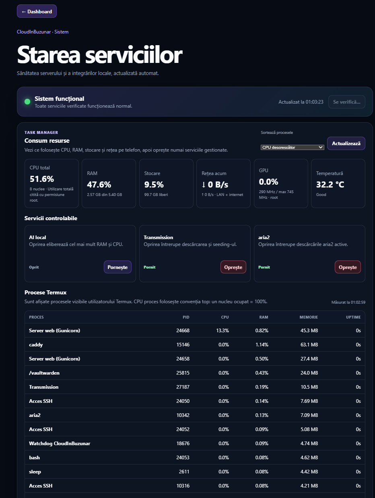
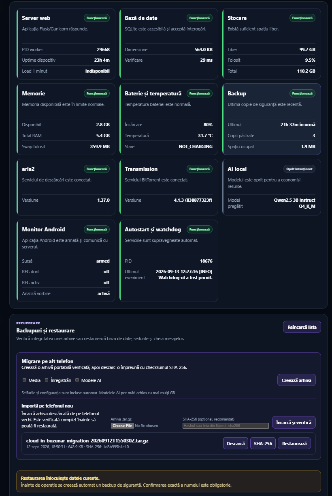
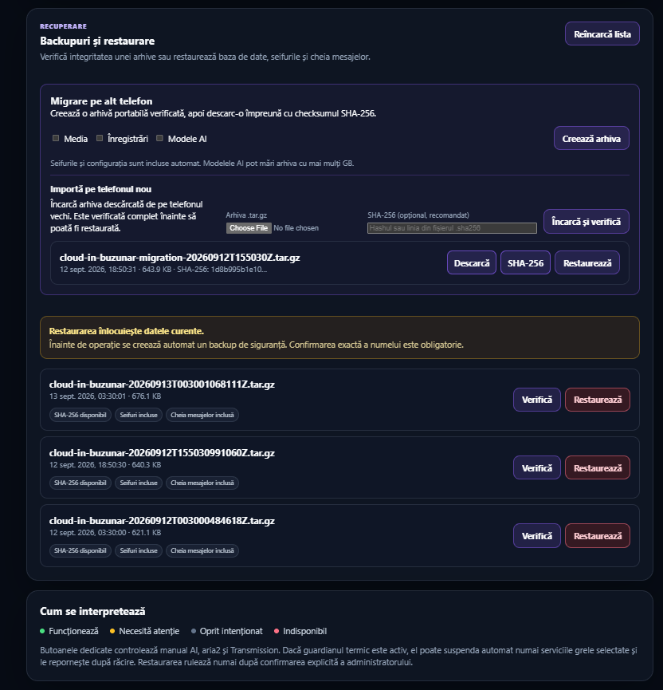
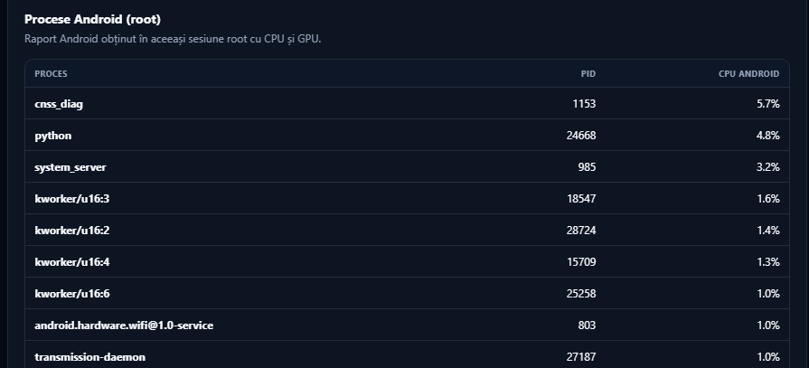
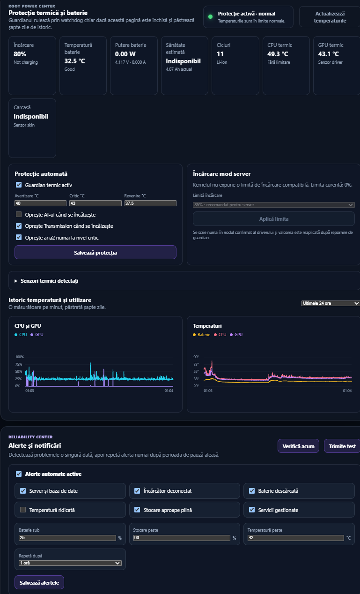
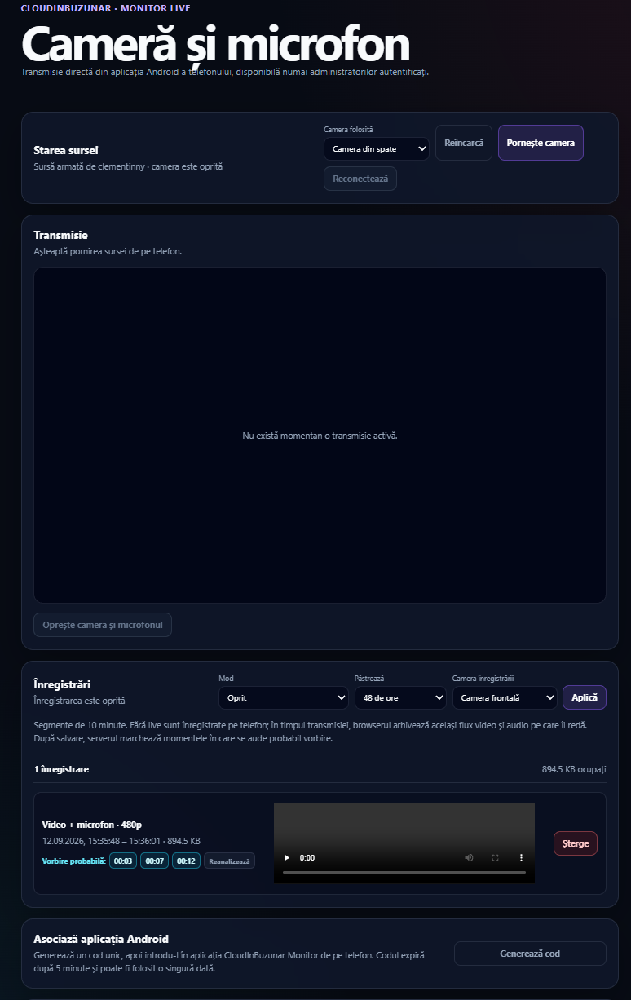
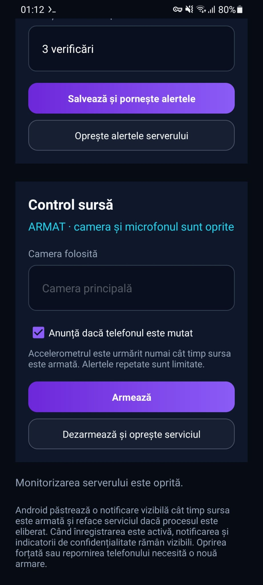
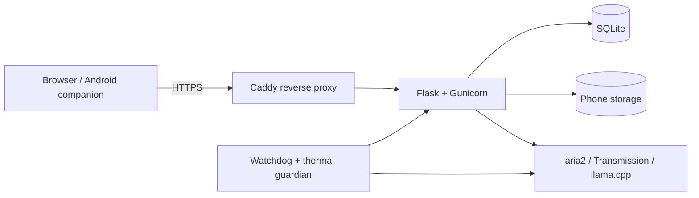

# CloudInBuzunar

[](https://github.com/clementinny/cloud-in-buzunar/actions/workflows/tests.yml)

CloudInBuzunar is my personal home-server project built around a rooted Samsung
Galaxy A70 and Termux. It started as a practical experiment: how much useful
infrastructure can an older phone run reliably, without depending on a public
cloud provider?

The result is a responsive Flask application for personal files, media,
downloads, private messaging, local AI and system administration. A companion
Android application adds live camera/audio monitoring and independent server
alerts.



## What currently works

- Multi-user accounts, roles and administrator approval for new registrations
- Isolated file vaults and expiring public download links
- Media library with resumable uploads
- aria2 and Transmission download management
- Encrypted-at-rest private messages between users
- Local Qwen2.5 inference through `llama.cpp`, with selectable model profiles
- Automatic backups and checksum-verified migration archives
- CPU, RAM, storage, network, GPU, battery and process monitoring
- Root-aware Android process reporting and thermal protection
- HTTPS through Caddy, plus optional access over a private VPN
- Native Android companion for alerts, motion detection and opt-in WebRTC monitoring
- Vaultwarden as a separately managed password-vault service

## Interface

The status page is the operational centre of the project. It shows service
health, resource use and the processes running both inside Termux and across
Android.

<table>
  <tr>
    <td width="50%"></td>
    <td width="50%"></td>
  </tr>
  <tr>
    <td align="center"><sub>Service health and dependencies</sub></td>
    <td align="center"><sub>Backups and phone-to-phone migration</sub></td>
  </tr>
</table>

Root access is optional. When available, it adds system-wide process data and
hardware telemetry that normal Termux permissions cannot expose.



The thermal guardian records recent CPU, GPU and battery-temperature history.
It can suspend heavy managed services when the phone becomes too warm and
restore them after it cools down.



The monitor page controls an explicitly paired and armed Android source. Camera
and microphone access remains visible through Android's foreground-service
notification and privacy indicators.



<details>
  <summary>Android companion application</summary>
  <p>The source phone can be armed locally, switched between cameras and set to
  keep short rolling audio or video recordings. Pairing tokens are stored in
  Android Keystore.</p>
  
</details>

## Architecture



The application and its data are deliberately separated. Source code lives in
the Git repository, while databases, secrets, uploads, models, recordings and
backups stay under `~/cloud-in-buzunar-data` and are never committed.

## Design decisions

- **Resource limits matter.** Local AI is not started by default and can unload
  after inactivity. Download services can be stopped individually from the
  dashboard.
- **Recovery is part of the system.** Backups rotate automatically, while
  migration archives include checksums and can be validated before import.
- **A watchdog should not share every failure mode with the server.** The
  Android companion can check availability independently and raise a local
  notification if several checks fail.
- **Root access is isolated.** Normal web requests do not receive a general root
  shell. The status and control modules use small, predefined operations.
- **Monitoring is opt-in.** The source device must be paired and locally armed;
  Android continues to display the required foreground notification and privacy
  indicators.

## Technology

- Python 3, Flask, Gunicorn and SQLite
- HTML, CSS and vanilla JavaScript
- Caddy for the HTTPS reverse proxy
- `llama.cpp` with quantized Qwen2.5 models
- aria2 and Transmission
- Java Android companion application with WebRTC
- Termux, Termux:API and Termux:Boot
- GitHub Actions for Python, JavaScript and shell checks

## Repository layout

```text
app/                 Flask routes, services, templates and static files
android-monitor/     Native Android companion application
scripts/             Installation, service, HTTPS and migration utilities
tests/               Automated backend and service-management tests
docs/                Operations guide and interface screenshots
```

## Quick start

The supported target is an **aarch64 Android phone running Termux**. Clone the
repository inside Termux, then run the local installer:

```bash
git clone https://github.com/clementinny/cloud-in-buzunar.git
cd cloud-in-buzunar
chmod +x scripts/install-cloud-in-buzunar.sh
scripts/install-cloud-in-buzunar.sh --admin YOUR_USERNAME
```

The installer creates the Python environment, installs the required Termux
packages, initializes the database and prepares the service files. Local AI is
optional because its model files are large:

```bash
scripts/install-cloud-in-buzunar.sh --with-ai --admin YOUR_USERNAME
```

For HTTPS, Android builds, service commands, backup restore and migration, see
the [operations guide](docs/OPERATIONS.md).

The latest companion APK is available from the repository's
[Releases](https://github.com/clementinny/cloud-in-buzunar/releases) page.

## Verification

Every push runs syntax checks and the Python test suite through GitHub Actions.
Locally, the main checks are:

```bash
python -m compileall -q app tests
python -m unittest discover -s tests -p "test_*.py" -v
```

Physical camera capture, screen-off behaviour, charging limits and root-only
telemetry still need validation on the target Android device; automated backend
tests cannot prove those hardware paths.

## Security boundaries

This is a personal engineering project, not a hardened public-cloud product.
Administrative pages, Vaultwarden and monitoring endpoints should stay behind
HTTPS and preferably a trusted LAN or private VPN. Secrets, databases, uploaded
files, AI models and generated certificates are excluded from Git.

## What I learned

The most useful part of this project was combining software with real device
constraints: Android background limits, Linux services, authentication,
networking, storage, heat, battery wear and recoverability. It also gave me a
repeatable way to diagnose problems across the browser, Flask, Termux and the
Android companion instead of treating them as separate systems.

## Next steps

- Deploy AdGuard Home after the server moves to its permanent network
- Run and document a full restore drill on a second phone
- Improve signed Android release automation
- Continue reducing idle CPU use and battery temperature
